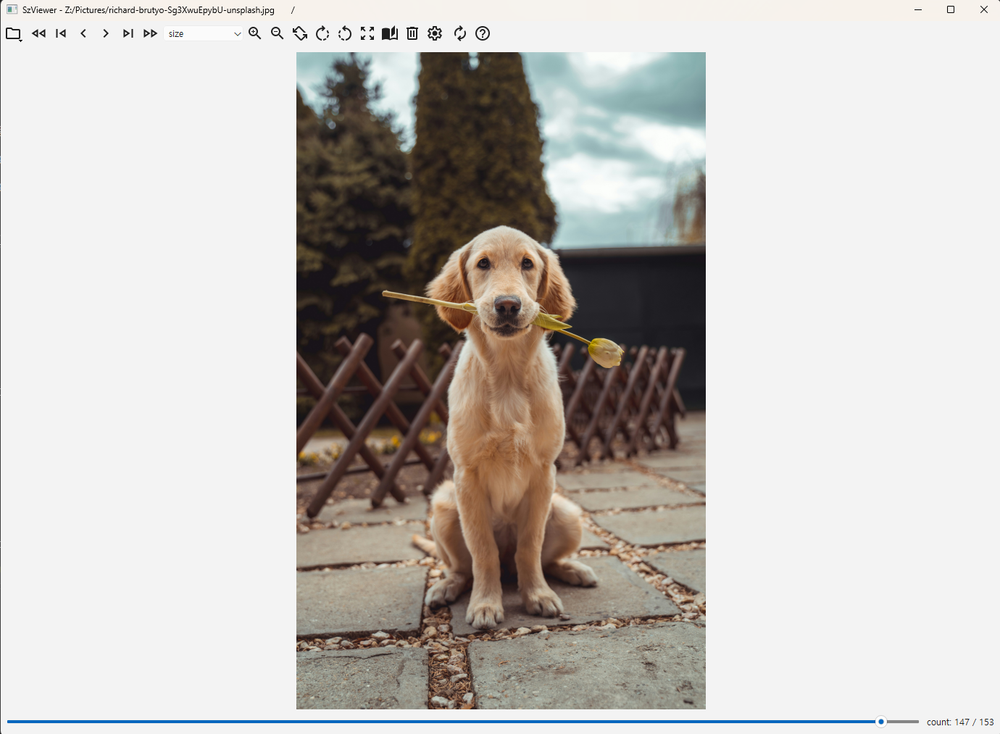
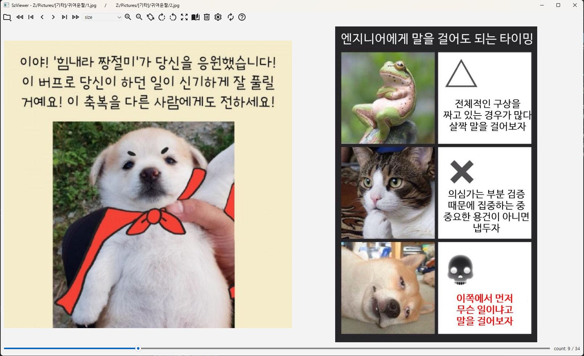
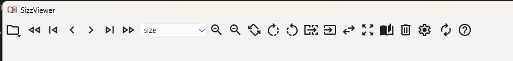
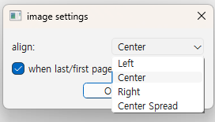
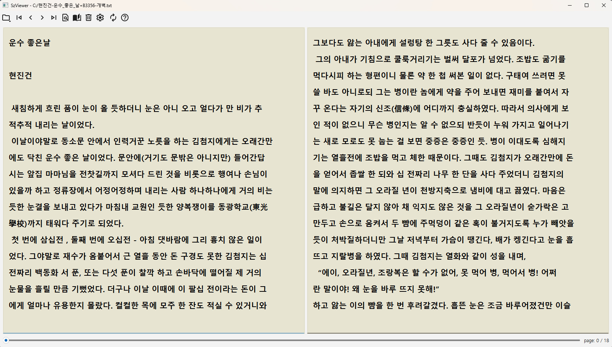
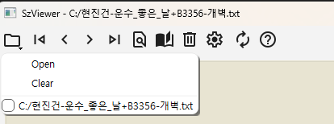
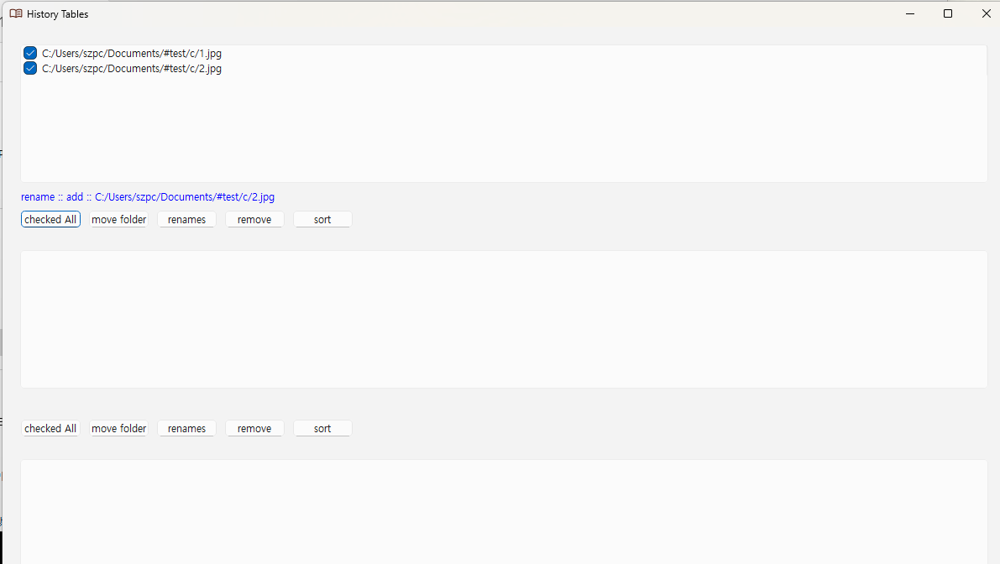

# Sizz Viewer
- 이름 변경 SzViewer -> Sizz Viewer

- 텍스트 / 이미지 뷰어 프로그램입니다. 
 
(맥북이 없어서 컴파일을 못해서... 현재 윈도우용만 릴리즈되어있습니다. 윈도우11 64비트에서 테스트 되었습니다.)

*.txt, *.jpg, *.jpeg, *.png, *.bmp, *.gif, *.webp , *.ico 등 지원합니다.  

파일을 드래그앤 드롭으로 넣으면 확장자에 따라 이미지뷰어/텍스트뷰어로 자동으로 열립니다.

zip 파일의 경우 내부 이미지와 텍스트파일이 혼합되어있다면 첫번째파일을 기준으로 열립니다.

**- 뷰어 공용 단축키**

Del : 파일 삭제

F2 : 파일 이름 변경

F5 : 1번 임시 파일 북마크 이동/삭제 (일괄파일명변경, 일괄이동등 지원, 파일 정리용입니다.)

F6 : 2번 임시 파일 북마크 이동/삭제 

F7 : 3번 임시 파일 북마크 이동/삭제 

F8 : 4번 임시 파일 북마크 이동/삭제 

### 이미지 뷰어
  화면 왼쪽 클릭 : 이전페이지, 화면 오른쪽 클릭 : 다음 페이지

  스크롤 존재시 마우스 오른쪽 버튼 드래그 : 화면 이동

**- 이미지 뷰어 단축키**

- `←, →` : 이전/다음 파일  
- `PgUp`, `PgDn` : 이전/다음 폴더  
- `1` : 윈도우 맞춤  
- `2` : 원본 크기  
- `3` : 가로 맞춤  
- `4` : 세로 맞춤  
- `5` : 이미지가 클때만 맞춤
- `+` : 확대  
- `-` : 축소  
- `f` : 전체화면
- `esc` : 전체화면 일때 해제
- `F2` : 파일 이름 변경
- `F3` : 폴더 이름 변경
- `N` : 좌우 보기 변경(일본만화)
- `M` : 이미지 첫 페이지 빈 페이지 추가
- `W`,`S`, `A`, `D` : 스크롤 이동 (방향키 up/down은 상하 스크롤 많이 이동)

**- 이미지 뷰어 툴바 설명**

좌측 부터 순서대로

- 파일열기/열었던 파일 히스토리(및 파일 고정) 메뉴
- 이전 폴더
- 첫 파일
- 이전 파일
- 다음 파일
- 마지막 파일
- 다음 폴더
- 사이즈 (윈도우에 맞춤, 원본, 가로 맞춤, 세로 맞춤, 이미지가 클때만 맞춤))
- 확대(10%)
- 축소(10%)
- 좌우반전
- -45도 회전
- +45도 회전
- 좌우 방향 변경(일본만화방식)
- 첫 페이지 빈 페이지 추가
- 두페이지 모아보기(spread)
- 전체화면
- 두페이지 보기/한페이지 보기
- 파일/폴더 삭제
- 이미지 셋팅

	align : 이미지 정렬 (좌, 가운데, 우, spred(2페이지 보기일때만 몰아보기)

	checkbox (when last~~) : 마지막/첫 페이지일때 다음 폴더 / 이전 폴더로 이동.

- 텍스트 뷰어 전환
- about

### 텍스트 뷰어

  화면 왼쪽 클릭 : 이전페이지, 화면 오른쪽 클릭 : 다음 페이지

**- 텍스트 뷰어 단축키**  
- `←`,`→` : 페이지 좌우 이동  
- `PgUp`, `PgDn` : 폴더 내 다음 파일, 이전 파일 
- 현재 *.txt (UTF-8)만 지원합니다.

**- 이미지 뷰어 툴바 설명**

좌측 부터 순서대로

- 파일열기/열었던 파일 히스토리(및 파일 고정) 메뉴
- 이전 파일
- 이전 페이지
- 다음 페이지
- 다음 파일
- 텍스트 검색 다이얼로그
- 두페이지 보기/한페이지 보기
- 파일/폴더 삭제
- 텍스트 셋팅
- 텍스트 뷰어 전환
- about

### 파일 관리 팝업창  

- checked All : 전체파일 선택/해제

- move folder : 선택파일 폴더 이동(이동불가파일은 무시됩니다.)

- renames : 선택파일 이름변경(이름변경불가파일은 무시됩니다.)

이름변경 정규식 

`?` : 원본이름 유지 

ex ) 원본이름.txt 변경 시 : 입력 -> `?_newname` , 결과 -> `원본이름_newname.txt`

`<자리수|시작번호>` : 자리수만큼 숫자를 채워넣고 시작번호부터 시작
`<>` 입력은 `<3|1>` 과 동일합니다.

ex ) 원본이름.txt, test.txt 변경 시 : 입력 -> `<3|1>_newname` , 결과 -> `001_newname.txt` , `002_newname.txt`

원본이름.txt, test.txt 변경 시 : 입력 -> `<2|3>_newname` , 결과 -> `03_newname.txt` , `04_newname.txt`

- sort : 리스트 내 정렬(윈도우 이름순)
	
## Third Party Libraries
[Qt 6.8.2 : https://www.qt.io/download-open-source ] 

[Icon  : https://fonts.google.com/icons ] 
- Material Design Icons by Google Licensed under the Apache License 2.0

[압축파일]
- miniz (Public Domain - Unlicense) - Compression library

